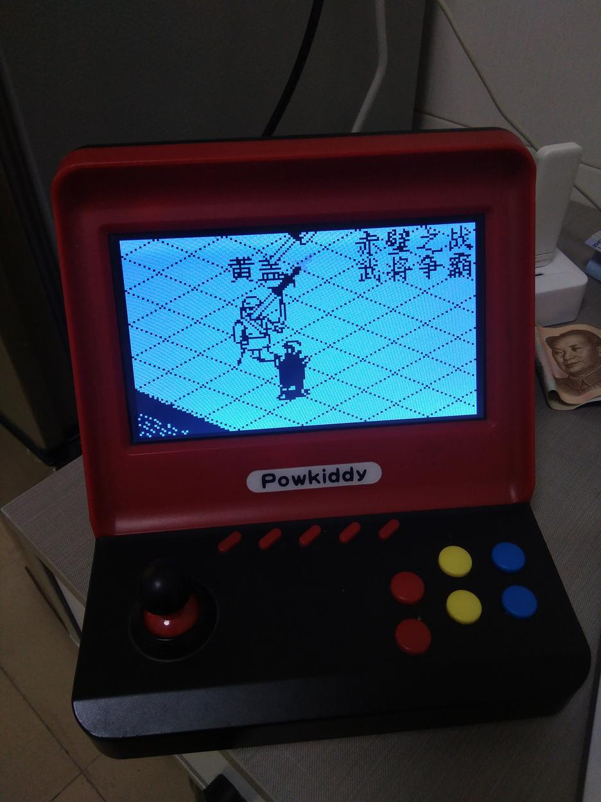

## 硬件参数
- 名称: PowKiddy A9
- 品牌: 霸王小子
- 系统: Linux (buildroot 2018.02-rc3-g71955e8-dirty)
- 处理器: Rockchip RK3128
- 内存: 256 MiB
- 存储: 107 MiB



## 固件导出
1. 使用双工头USB线连接主机和游戏机，游戏机有2个USB口，用上面的那个。
2. 按住SELECT, VOL+, VOL-, BACK这4个键的同时，再按游戏机电源键开机。此时应成功进入 Mask ROM 模式。
3. 使用 `xrock flash` 命令查看 flash 信息，使用 `xrock flash read 0 220672 flash.bin` 命令导出固件。

## 固件分析
固件采用 GPT 分区，可通过 `fdisk -x flash.bin` 命令查看分区信息：

```
Disk flash.bin: 107.75 MiB, 112984064 bytes, 220672 sectors
Units: sectors of 1 * 512 = 512 bytes
Sector size (logical/physical): 512 bytes / 512 bytes
I/O size (minimum/optimal): 512 bytes / 512 bytes
Disklabel type: gpt
Disk identifier: 5F7B0000-0000-4C20-8000-022D0000317F
First usable LBA: 34
Last usable LBA: 220638
Alternative LBA: 220671
Partition entries starting LBA: 2
Allocated partition entries: 128
Partition entries ending LBA: 33

Device      Start    End Sectors Type-UUID                            UUID                                 Name     Attrs
flash.bin1   8192  10239    2048 E1710000-0000-4824-8000-52D600007EDC 1D3B0000-0000-443C-8000-4BF900005D41 uboot
flash.bin2  10240  14335    4096 643B0000-0000-4273-8000-7B8800004EEF 47610000-0000-4232-8000-65B300001969 trust
flash.bin3  14336  34815   20480 97750000-0000-4612-8000-4EEC00001F6F 656F0000-0000-4E2F-8000-12E400002601 boot
flash.bin4  34816 157695  122880 02410000-0000-4B72-8000-708B00003161 614E0000-0000-4B53-8000-1D28000054A9 rootfs
flash.bin5 157696 198655   40960 2E090000-0000-4908-8000-49EC00004ACF 9E210000-0000-4C10-8000-08C80000439F oem
flash.bin6 198656 220638   21983 A2780000-0000-494B-8000-0798000034C0 C91D0000-0000-4065-8000-2B8C000067B5 userdata
```

可以看到固件包含了 6 个分区，分别为 `uboot`，`trust`，`boot`，`rootfs`，`oem` 和 `userdata`。要挂载这些分区，可执行 `losetup --find --partscan --show flash.bin` 命令先获得 `/dev/loopNp{1..6}` 分区设备，再通过 `mount /dev/loop0p4 /tmp/rootfs` （假如 `losetup` 输出 `/dev/loop0`，我们要挂载 `rootfs` 分区到 `/tmp/rootfs`） 命令挂载即可。


### rootfs
- 通过 `readelf -a lib/libc.so.6 | grep GLIBC_` 命令判断出 glibc 的版本为 `2.26`。
- 主界面程序 `/userdata/game` 由 `/etc/init.d/S50ui` 启动。
- 内置的模拟器为 `/usr/bin/retroarch`，核心在 `/usr/local/share/minigui/res/game_lib` 目录。

## 固件修改
1. 准备交叉编译工具链，并编译 alsa-lib, eudev, libdrm 等软件。
- gcc-linaro-7.4.1-2019.02-x86_64_arm-linux-gnueabihf.tar.xz
- alsa-lib
- libxkbcommon
- eudev
- libdrm
- libglvnd, gbm.h, libmali


2. 编译 RetroArch

```
export PATH=${PATH}:/opt/rk3128/bin

export CFLAGS="--sysroot=/opt/rk3128/sysroot -march=armv7-a -mtune=cortex-a7 -mfpu=neon-vfpv4 -mfloat-abi=hard -Ofast -mthumb -flto"
export CXXFLAGS="$CFLAGS"
export LDFLAGS="$CFLAGS -Wl,--allow-shlib-undefined"
export PKG_CONFIG_PATH=/opt/rk3128/arm-linux-gnueabihf/libc/lib/pkgconfig

./configure \
	--prefix=/usr \
	--host=arm-linux-gnueabihf \
	--disable-networking \
	--disable-rewind \
	--disable-runahead \
	--enable-opengles \
	--disable-ffmpeg \
	--with-opengles_libs="-lmali" \
	--enable-kms \
	--disable-x11 \
	--disable-sdl2 \
	--enable-udev \
	--enable-alsa \
	--disable-tinyalsa \
	--disable-oss \
	--disable-xmb \
	--disable-ozone \
	--disable-materialui \
	--disable-langextra \
	--disable-overlay \
	--disable-gfx_widgets \
	--disable-stb_font \
	--enable-neon
```

3. 替换 `/userdata/game` 为 shell 脚本直接启动 `retroarch` 或者 sdcard 的 `start.sh`。

```
#!/bin/sh

echo $$ > /tmp/pid  #  will be killed when ac/battery changed

# XXX: must open this file to keep the system alive!
cat /sys/devices/platform/leon-gpio-report/startget

# ensure /sdcard is mounted, prefer ext4
for fstype in ext4 ext3 ext2 ntfs-3g exfat-fuse vfat; do
  mount -t $fstype /dev/mmcblk0p1 /mnt/sdcard && break || true
done

export PATH=/sdcard/bin:/data/bin:${PATH}

# choose config directory for retroarch
if [[ -d /sdcard/retroarch ]]; then
  if [[ ! -e /sdcard/retroarch/retroarch.cfg ]]; then
    cp /data/retroarch/retroarch_sdcard.cfg /sdcard/retroarch/retroarch.cfg
  fi
  export XDG_CONFIG_HOME=/sdcard
else
  export XDG_CONFIG_HOME=/data
fi

# start the real game
if [[ -x /sdcard/start.sh ]]; then
  # prefer run 'start.sh' from sdcard
  bash /sdcard/start.sh
else
  # fallback to 'retroarch'
  retroarch
fi

# goodbye
poweroff
```

其中 `/sys/devices/platform/leon-gpio-report/startget` 为通过 `strace` 命令观察原 `game` 进程分析所得，若不读取此文件则系统会在数秒后被重置。

4. 写回固件修改
- `dd if=flash.bin skip=101711872B bs=11251712 count=1 of=userdata.img`
- `mount userdata.img /tmp/userdata`
- 在 `/tmp/userdata` 完成修改后 `umount /tmp/userdata`
- `xrock flash write 198656 userdata.img` 写回修改

## sdcard 结构

我分了 2 个区，sdb1 为 ext4， sdb2 作为 swap：
```
/dev/sdb1           2048 60024831 60022784 28.6G 83 Linux
/dev/sdb2       60024832 61073407  1048576  512M 82 Linux swap / Solaris
```

主分区：
```
bin
retroarch
  assets
  autoconfig
  config
  cores
  shaders
  systems
  ...
roms
  ARCADE
  GBA
  PSX
  ...
start.sh
```

start.sh 内容:
```
#!/bin/sh
export XDG_CONFIG_HOME=/sdcard
export XDG_DATA_HOME=/sdcard
swapon /dev/mmcblk0p2

retroarch
poweroff
```
